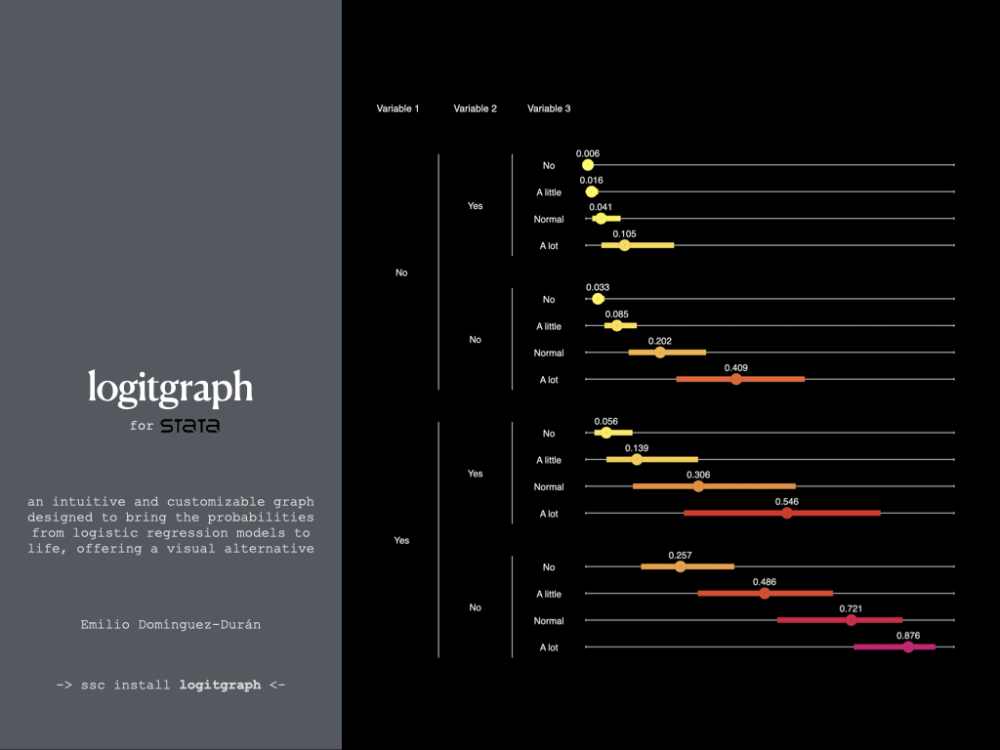

  

<b>Description:</b>

logitgraph is a chart that horizontally displays the probabilities and their confidence intervals for all combinations of categories of each independent variable in a logistic regression model.

<b>Program Limitations:</b>

1. Logitgraph quietly runs the command <i>logit varname varlist</i>. Its goal is to visually display the probabilities and their confidence intervals in an appealing way by showing probabilities directly instead of logits.

2. Logitgraph has not been designed to select the most appropriate variables for inclusion in the model. This graph should be created once the independent variables that will make up the final model have been selected.

3. This program will display the variable labels instead of the variable names and the value labels of the categories instead of the values.

4. The final result of the chart vary significantly depending on the number of categories for each of the selected independent variables. Once a preliminary chart has been constructed, the dialog box can be useful for small adjustments.
